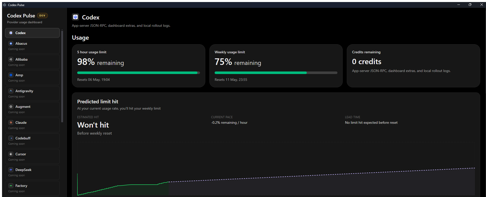
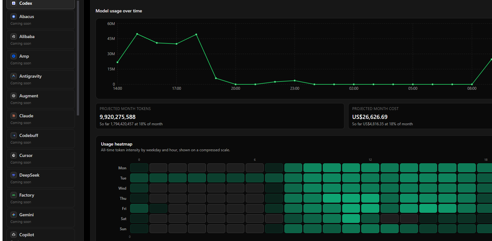

# Codex Pulse

Codex Pulse is a local, privacy-first desktop companion for monitoring Codex usage and related provider telemetry without proxying prompts or shipping data off the machine.

It is built for the beta release line and currently ships with Codex as the active provider. The rest of the provider catalog is scaffolded for future expansion and marked `Coming soon`.

## Screenshots

### Overview



### Model usage and heatmap



## What it does

- Monitors Codex usage locally without replacing the normal Codex app.
- Reads local auth and usage state when available.
- Stores usage snapshots in local SQLite only.
- Shows predicted limit hit timing based on recent activity.
- Visualizes model usage trends, projections, and an all-time heatmap.
- Runs tray-first and starts hidden on installed builds.
- Supports a provider catalog so additional agents can be added without reworking the UI.

## Current status

- `Codex` is the only active provider.
- Other providers are listed but marked `Coming soon`.
- The app is configured for tray-first startup on installed builds.
- Update checks, packaging, and release workflows are already wired in.

## Why this exists

The goal is a small local utility that answers:

- How much usage is left?
- How quickly is it burning?
- When is it likely to run out?
- What does usage look like over time?

The app deliberately stays read-only.

## Tech stack

- Electron
- Electron Vite
- React
- TypeScript
- Tailwind CSS
- Recharts
- better-sqlite3
- electron-builder

## Security model

- No prompt proxying.
- No upload of usage data.
- No token display in the UI.
- Secrets stay in local app storage or the OS credential store.
- Snapshots stay on disk in the local SQLite database.

## Getting started

```bash
npm install
npm run dev
```

## Validation

```bash
npm run typecheck
npm run build
```

## Packaging

Build installers and app bundles with:

```bash
npm run dist
```

Supported release targets:

- Windows `nsis`
- macOS `dmg`
- Linux `AppImage`

Release and signing guidance lives in [docs/RELEASE.md](docs/RELEASE.md).

## Repository docs

- [Architecture](docs/ARCHITECTURE.md)
- [Release and signing](docs/RELEASE.md)
- [Roadmap](docs/ROADMAP.md)
- [Contributing](CONTRIBUTING.md)
- [Code of Conduct](CODE_OF_CONDUCT.md)
- [Screenshots](docs/screenshots/README.md)

## Development notes

- Provider-specific settings are handled in the main process and surfaced through the renderer.
- Model usage parsing runs asynchronously to keep the UI responsive.
- The sidebar is tray-first and intentionally compact for background use.

## Reference material

- [CodexBar](https://github.com/steipete/CodexBar)
- [CodexBar Codex provider docs](https://github.com/steipete/CodexBar/blob/main/docs/codex.md)
- [CodexBar provider authoring guide](https://github.com/steipete/CodexBar/blob/main/docs/provider.md)
